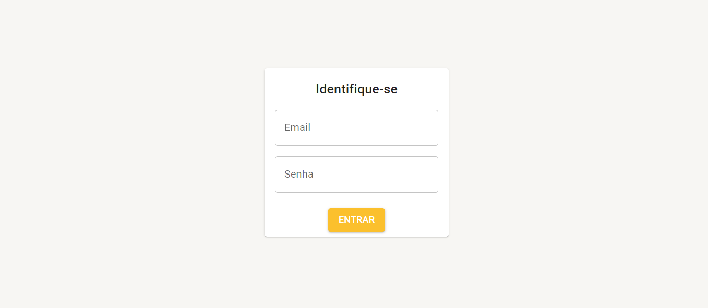
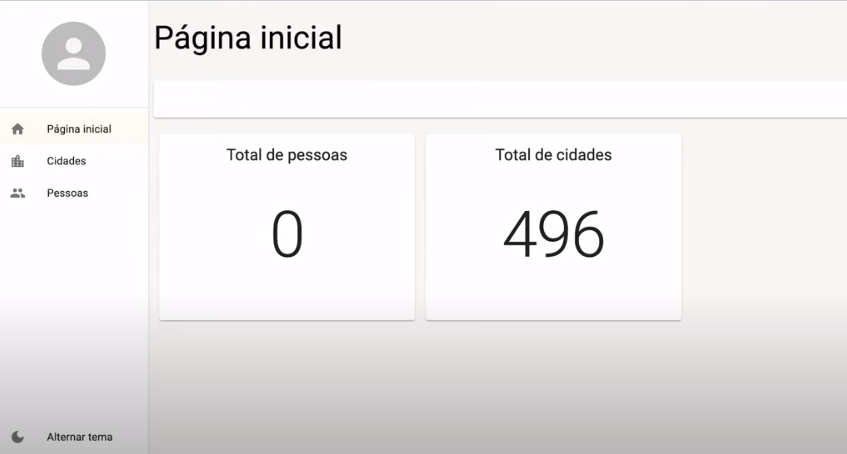
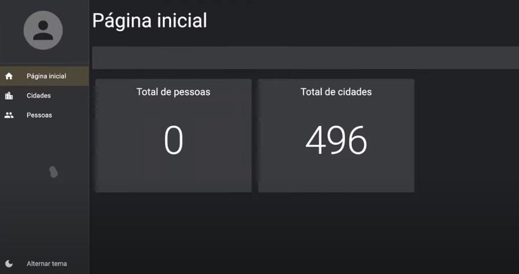
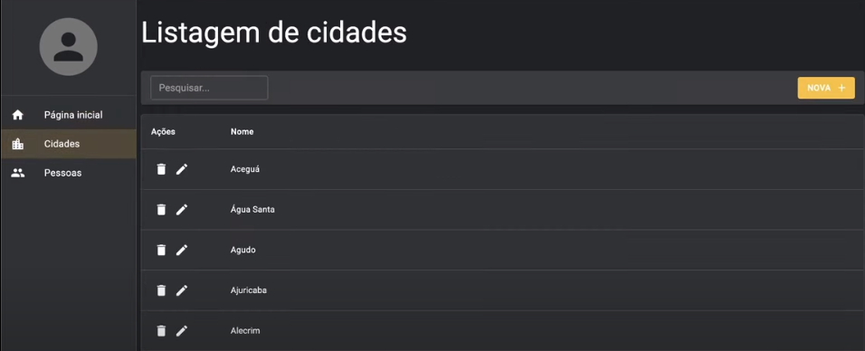
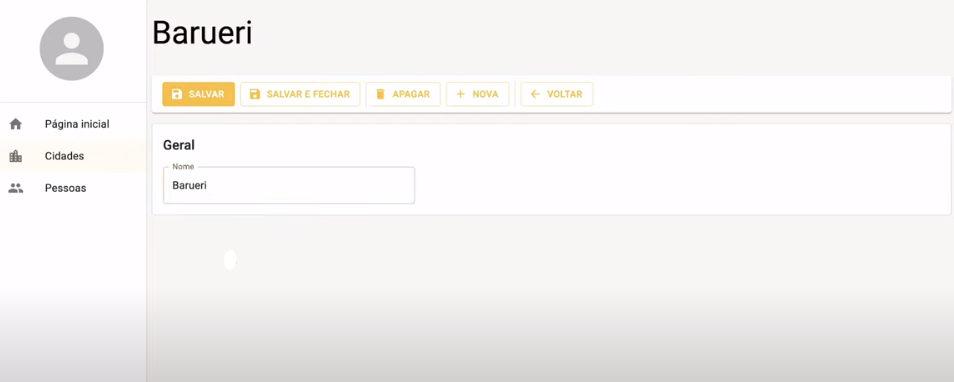
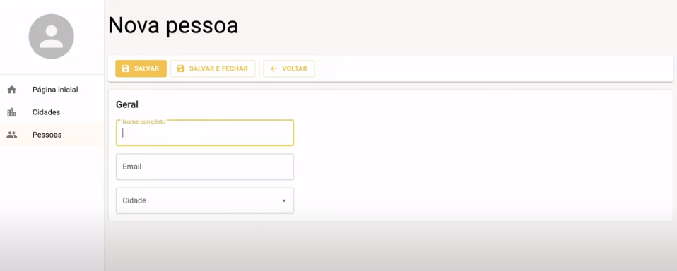
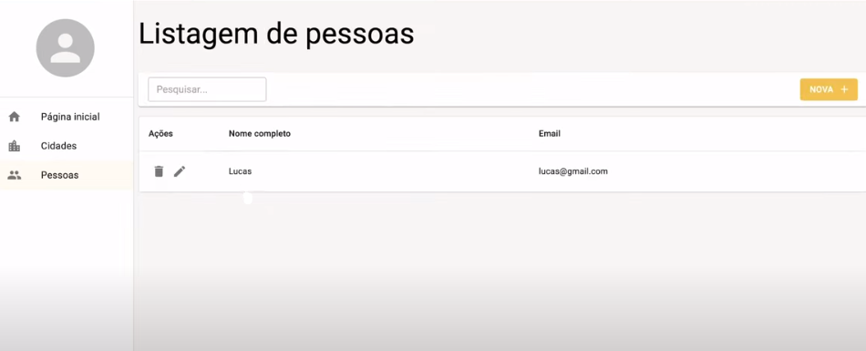

# CIDADAO COM API REST
👨‍🏫PROJETO CRIADO PARA O CURSO DE API REST.

 <br> 
 <br> 
 <br> 
 <br> 
 <br> 
 <br> 
 <br> 

## DESCRIÇÃO:
- O aplicativo é uma ferramenta de gerenciamento de cidades e populações. Ele permite que os usuários visualizem, adicionem, editem e removam informações sobre pessoas e cidades (CRUD). 

- O aplicativo foi construído utilizando uma `API REST` com TypeScript, SQLite, Express.js e React.

### TELA INICIAL:
A tela inicial do aplicativo é composta pelos seguintes elementos:

* **Barra de título:** A barra de título contém o nome do aplicativo, "Cidades".
* **Menu lateral:** O menu lateral permite a navegação entre as seções "Página inicial", "Cidades" e "Pessoas".
* **Seção "Página inicial":** Esta seção contém um resumo das principais informações do aplicativo, como o número total de pessoas e o número total de cidades cadastradas.

### TELA DE CIDADES:
Nesta seção, os usuários podem visualizar, adicionar, editar e remover cidades. A tela é composta pelos seguintes elementos:

* **Lista de cidades:** Exibe uma lista das cidades cadastradas, com opções para editar ou remover cada uma delas.
* **Botão "Nova":** Permite adicionar uma nova cidade.
* **Campos de formulário:** Incluem campos como "Nome" para adicionar ou editar uma cidade.

### TELA DE PESSOAS:
Nesta seção, os usuários podem gerenciar as informações das pessoas cadastradas no sistema. A tela é composta pelos seguintes elementos:

* **Lista de pessoas:** Exibe uma lista de pessoas cadastradas, com opções para editar ou remover cada uma delas.
* **Botão "Nova":** Permite adicionar uma nova pessoa.
* **Campos de formulário:** Incluem campos como "Nome completo", "Email" e "Cidade" para adicionar ou editar informações de uma pessoa.

### TELA DE ADIÇÃO/EDIÇÃO:
Ao adicionar ou editar uma pessoa ou cidade, o usuário é levado a uma tela com um formulário. Esta tela permite inserir os dados necessários e salvar as informações.

## FUNCIONALIDADES:
**Autenticação de Usuário:**
* **Título:** "Identifique-se" indica que o formulário serve para que os usuários se autentiquem.
* **Campo de e-mail:** Onde o usuário deve inserir seu endereço de e-mail.
* **Campo de senha:** Onde o usuário deve inserir sua senha.
* **Botão de login:** Envia as informações inseridas para o sistema realizar a autenticação.

**Gerenciamento de Pessoas e Cidades:**
* **Visualização do número total de pessoas em um determinado local:** Exibe o número total de pessoas cadastradas em uma cidade específica.
* **Visualização do número total de cidades em um determinado local:** Exibe o número total de cidades cadastradas no sistema.
* **Adição, edição e remoção de pessoas e cidades:** Permite a gestão completa das informações cadastradas.
* **Alternância entre tema claro e escuro:** Permite que os usuários alternem entre o tema claro e o tema escuro do aplicativo para melhor conforto visual.

## EXECUTANDO O PROJETO:
1. **Instalando as Dependências:**
   - Para instalar as dependências listadas no arquivo "package.json", você pode usar o comando `npm install` no terminal. Certifique-se de estar no diretório `CODIGO/API` e `CODIGO/CLIENTE` e execute o seguinte comando:
   ```bash
   npm install
   ```

2. **Executando o Aplicativo:**
   - Para iniciar aplicativo e o servidor, você deve estar no diretório `CODIGO/API` e `CODIGO/CLIENTE`. Abra dois terminais e execute o seguinte comando em cada um:
   ```bash
   npm start
   ```

   - Acesse o aplicativo no navegador visitando [http://localhost:3000/](http://localhost:3000/).

## INTERAGINDO COM O APLICATIVO:
### 1. LOGIN:
1. **Preencher o campo de e-mail:** Insira seu endereço de e-mail no campo designado.
2. **Preencher o campo de senha:** Insira sua senha no campo apropriado.
3. **Clicar no botão "ENTRAR":** Envie suas informações de login para acessar o aplicativo.

### 2. NAVEGAÇÃO ENTRE SEÇÕES:
1. **Página inicial:** Acesse um resumo das informações principais, como o número total de cidades e pessoas cadastradas.
2. **Cidades:** Gerencie as cidades cadastradas, podendo adicionar, editar ou remover cidades.
3. **Pessoas:** Gerencie as pessoas cadastradas, podendo adicionar, editar ou remover pessoas.

### 3. GERENCIAMENTO DE CIDADES:
1. **Adicionar uma nova cidade:**
   1. Clicar no botão "Nova".
   2. Preencher o campo "Nome" com o nome da cidade.
   3. Clicar no botão "Salvar" para adicionar a cidade ao sistema.

2. **Editar uma cidade existente:**
   1. Clicar no ícone de edição (lápis) ao lado da cidade que deseja editar.
   2. Atualizar o campo "Nome" conforme necessário.
   3. Clicar no botão "Salvar" para atualizar as informações da cidade.

3. **Remover uma cidade:**
   1. Clicar no ícone de lixeira ao lado da cidade que deseja remover.
   2. Confirmar a remoção quando solicitado.

### 4. GERENCIAMENTO DE PESSOAS:
1. **Adicionar uma nova pessoa:**
   1. Clicar no botão "Nova".
   2. Preencher os campos "Nome completo", "Email" e selecionar a "Cidade".
   3. Clicar no botão "Salvar" para adicionar a pessoa ao sistema.

2. **Editar uma pessoa existente:**
   1. Clicar no ícone de edição (lápis) ao lado da pessoa que deseja editar.
   2. Atualizar os campos "Nome completo", "Email" e "Cidade" conforme necessário.
   3. Clicar no botão "Salvar" para atualizar as informações da pessoa.

3. **Remover uma pessoa:**
   1. Clicar no ícone de lixeira ao lado da pessoa que deseja remover.
   2. Confirmar a remoção quando solicitado.

### 5. ALTERAR TEMA:
1. **Encontrar o botão "Alternar tema":** Localizado na barra de navegação ou em um menu de configuração.
2. **Clicar no botão "Alternar tema":** Alterne entre o tema claro e o tema escuro para adaptar a interface do usuário ao seu conforto visual.

## NÃO SABE?
- Entendemos que para manipular arquivos em `HTML`, `CSS` e outras linguagens relacionadas, é necessário possuir conhecimento nessas áreas. Para auxiliar nesse aprendizado, oferecemos cursos gratuitos disponíveis:
* [CURSO DE HTML E CSS](https://github.com/VILHALVA/CURSO-DE-HTML-E-CSS)
* [CURSO DE TYPESCRIPT](https://github.com/VILHALVA/CURSO-DE-TYPESCRIPT)
* [CURSO DE REACT](https://github.com/VILHALVA/CURSO-DE-REACT)
* [CURSO DE EXPRESSJS](https://github.com/VILHALVA/CURSO-DE-EXPRESSJS)
* [CURSO DE SQLITE](https://github.com/VILHALVA/CURSO-DE-SQLITE)
* [CONFIRA MAIS CURSOS](https://github.com/VILHALVA?tab=repositories&q=+topic:CURSO)

## CREDITOS:
- [PROJETO FEITO PELO VILHALVA](https://github.com/VILHALVA)
- [PROJETO CRIADO PARA O CURSO DE API REST](https://github.com/VILHALVA/CURSO-DE-API-REST)


